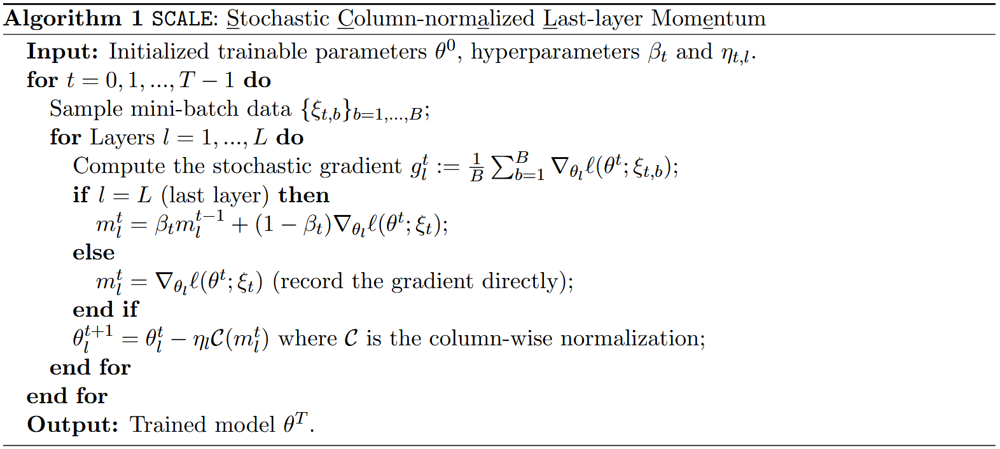
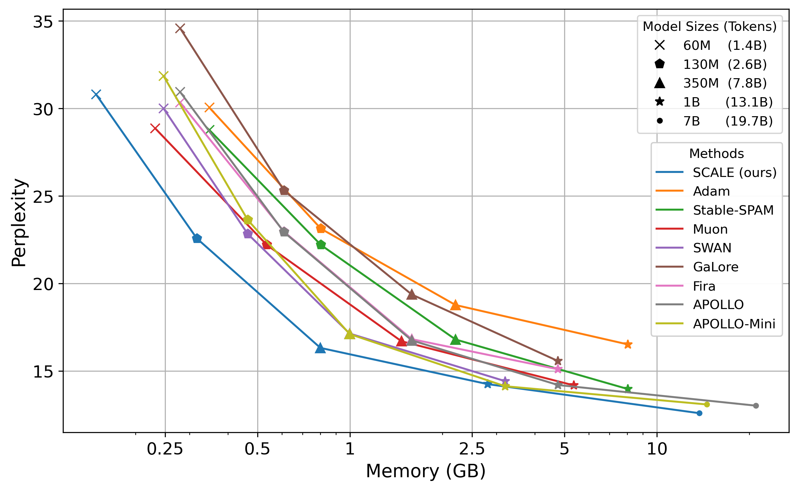

# A Minimalist Optimizer Design for LLM Pretraining

<a href="https://arxiv.org/abs/2506.16659">
  
</a>

Preliminary code release for our paper "A Minimalist Optimizer Design for LLM Pretraining", by Athanasios Glentis, Jiaxiang Li,  Andi Han and Mingyi Hong.

## SCALE Optimizer

We introduce our proposed optimizer, SCALE, detailed in Algorithm 1. The design of SCALE is motivated by empirical insights from our experiments, which highlighted the importance of stabilizing updates in the last layer and controlling gradient scale via column-wise normalization. Accordingly, SCALE integrates two components: 

- column-wise normalization of gradients
- first order momentum restricted to the last layer

Despite its minimalist design, SCALE is highly effective, outperforming baselines such as Adam and achieving performance competitive with state-of-the-art Stable-SPAM and Muon, while using substantially less memory.

<div align="center">
  
</div>


## Results

**Pareto frontier:** Perplexity v.s. memory consumption among a number of state-of-the-art algorithms. SCALE lies on the Pareto frontier, achieving optimal memory efficiency while maintaining (near) state‐of‐the‐art perplexity.


<div align="center">
  
</div>

**Numerical Results:** Bellow we include our numerical results for pretraining LLaMA models on the C4 dataset. We report evaluation perplexity as our metric (and model+optimizer memory in parentesis).

#### LLaMA 60M-1B:

<div align="center">

| Model Size   | 60M                  | 130M                 | 350M                 | 1B                   |
|:--------------|:-----------------:|:-----------------:|:-----------------:|:-----------------:|
| Tokens       | 1.4B                 | 2.6B                 | 7.8B                 | 13.1B                |
| Adam         | 30.05 (0.35G)        | 23.13 (0.81G)        | 18.77 (2.21G)        | 16.52 (8.04G)        |
| Stable-SPAM  | **28.77** (0.35G)    | **22.20** (0.81G)    | 16.80 (2.21G)        | **13.97** (8.04G)    |
| Muon         | **28.86** (0.23G)    | **22.20** (0.54G)    | 16.70 (1.47G)        | 14.18 (5.36G)        |
| GaLore       | 34.58 (0.28G)        | 25.31 (0.61G)        | 19.37 (1.59G)        | 15.57 (4.76G)        |
| Fira         | 30.34 (0.28G)        | 22.96 (0.61G)        | 16.82 (1.59G)        | 15.10 (4.76G)        |
| SWAN         | 30.00 (0.25G)        | 22.83 (0.46G)        | 17.14 (1.00G)        | 14.42 (3.20G)        |
| APOLLO       | 30.94 (0.28G)        | 22.93 (0.61G)        | 16.75 (1.59G)        | 14.20 (4.76G)        |
| APOLLO-Mini  | 31.85 (0.25G)        | 23.63 (0.46G)        | 17.11 (1.00G)        | 14.13 (3.20G)        |
| SCALE (ours) | 30.81 (**0.15G**)    | 22.57 (**0.32G**)    | **16.32** (**0.80G**)| 14.25 (**2.81G**)    |

</div>

#### LLaMA 7B:

<div align="center">

| Steps          |   40K  |   80K  |  120K  |  150K  |
|:--------------:|:------:|:------:|:------:|:------:|
| Tokens                    |  5.2B  | 10.5B  | 15.7B  | 19.7B  |
| APOLLO      (16.14G)     | 17.55  | 14.39  | 13.23  | 13.02  |
| APOLLO-Mini (14.53G)     | 18.03  | 14.60  | 13.32  | 13.09  |
| SCALE (ours) (**13.74G**) | 17.99  | 14.57  | 12.86  | **12.59**  |

</div>


## Usage

The SCALE optimizer code can be found in `mem_eff_pt/pt_scale/scale_optimizer.py`. The repository provides the scripts used in our experiments in the `scripts/` directory.

Example script (`350m_scale.sh`):

```bash
torchrun --standalone --nproc_per_node 4 torchrun_main_DDP.py \
    --model_name 350m_scale \
    --model_config configs/llama_350m.json \
    --optimizer scale \
    --lr 1e-3 \
    --momentum 0.9 \
    --weight_decay 0.0 \
    --batch_size 128 \
    --total_batch_size 512 \
    --num_training_steps 60000 \
    --warmup_steps 6000 \
    --dtype bfloat16 \
    --eval_every 1000 \
    --save_every 99999 \
    --seed 42  \
    --scheduler cosine \
    --dataset_path /path/to/c4/en \
```


## Citation

If you find this work useful for your research, please cite our paper:
```bibtex
@article{glentis2025minimalist,
  title={A Minimalist Optimizer Design for LLM Pretraining},
  author={Glentis, Athanasios and Li, Jiaxiang and Han, Andi and Hong, Mingyi},
  journal={arXiv preprint arXiv:2506.16659},
  year={2025}
}
```
